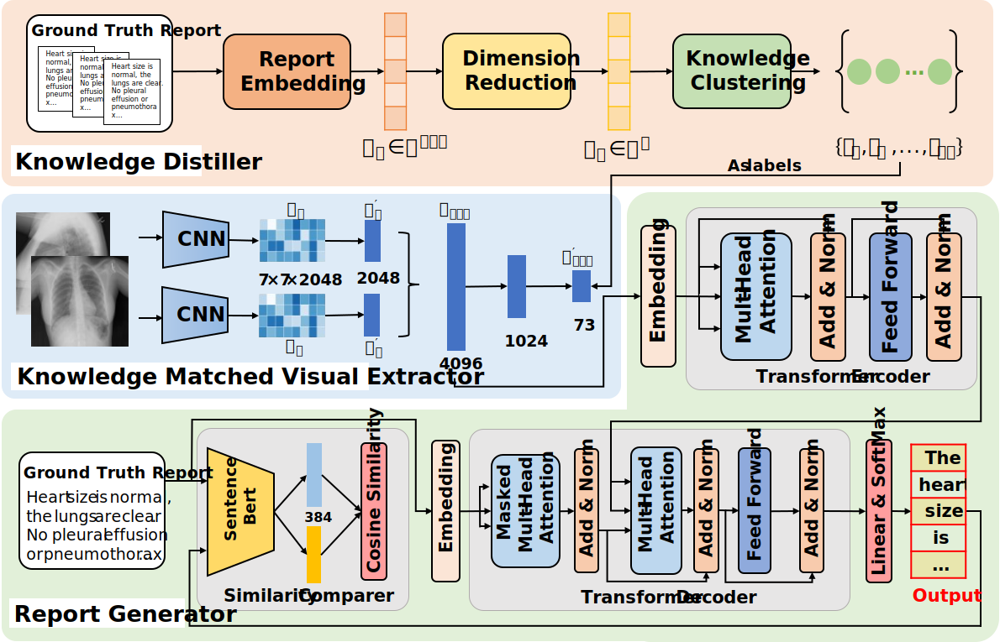

# A Self-Guided Framework for Radiology Report Generation

This repository contains the code accompanying the paper "A Self-Guided Framework for Radiology Report Generation", accepted for publication at MICCAI 2022 (https://arxiv.org/).

## Citation

If you find this repo useful for your research, please consider citing our paper:

```latex
@inproceedings{
}

```

Automatic radiology report generation is essential to computer-aided diagnosis. Through the success of image captioning, medical report generation has been achievable. However, the lack of annotated disease labels is still the bottleneck of this area. In addition, the image-text data bias problem and complex sentences make it more difficult to generate accurate reports. To address these gaps, we present a self-guided framework (SGF), a suite of unsupervised and supervised deep learning methods to mimic the process of human learning and writing. In detail, our framework obtains the domain knowledge from medical reports without extra disease labels and guides itself to extract fined-grain visual features associated with the text. Moreover, SGF successfully improves the accuracy and length of medical report generation by incorporating a similarity comparison mechanism that imitates the process of human self-improvement through comparative practice. Extensive experiments demonstrate the utility of our SGF in the majority of cases, showing its superior performance over state-of-the-art methods. Our results highlight the capacity of the proposed framework to distinguish fined-grained visual details between words and verify its advantage in generating medical reports.



## Usage

- To run Knowledge Distiller

  ```
  cd Knowledge_Distiller
  python knowledge_distiller.py
  ```

- To train the SGF

  ```
  cd KMVE_RG
  python my_main.py
  ```

- To evaluate the model

  - The heatmap will generate in the attn_pth
  
  ```
  cd KMVE_RG
  python my_predict.py
  ```
  
- To change config of the network

  ```
  You can change the config of the network in KMVE_RG/config.py
  ```

## Datasets

Our experiments are conducted on the IU-Xray public dataset. IU-Xray is a large-scale dataset of chest X-rays, constructed by 7,470 chest X-ray images and 3,955 radiology reports. You can download the images' file through  https://openi.nlm.nih.gov/.

## Resources

```
cudatoolkit=11.1.1
python=3.8.11
pytorch=1.9.0=py3.8_cuda11.1_cudnn8_0
scikit-learn=0.23.2
scipy=1.6.2
seaborn=0.11.2
yacs=0.1.8
yaml=0.2.5
```

## Acknowledgments

This work was supported in part by Key-Area Research and Development Program of Guangdong Province (No.2020B0909020002), National Natural Science Foundation of China (Grant No. 62003330), Shenzhen Fundamental Research Funds (Grant No. JCYJ20200109114233670, JCYJ20190807170407391), and Guangdong Provincial Key Laboratory of Computer Vision and Virtual Reality Technology, Shenzhen Institutes of Advanced Technology, Chinese Academy of Sciences, Shenzhen, China. This work was also supported by Guangdong-Hong Kong-Macao Joint Laboratory of Human-Machine Intelligence-Synergy Systems, Shenzhen Institute of Advanced Technology. The implementation of Self-guided Framework is mainly based on [R2Gen](https://github.com/cuhksz-nlp/R2Gen). We thanks the authors for their efforts.

